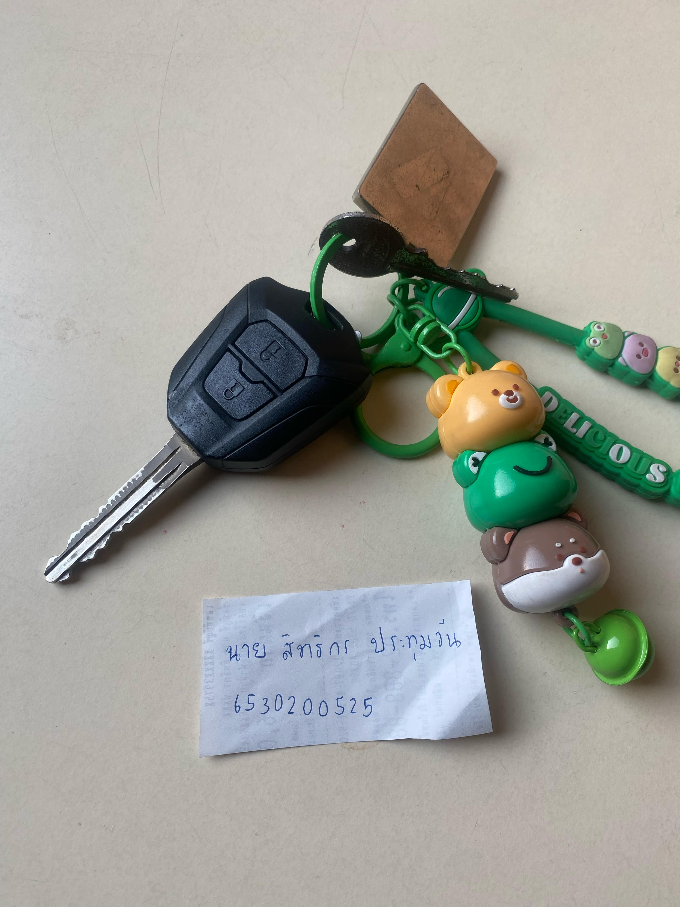

#୨ Security Control

Type of Security Controls : Physical Control

Control Functions :Preventative

Location : หมู่บ้านแฟมิลี่ปาร์ค

Why car key is Physical preventive ? :กุญแจรถยนต์เป็นสิ่งที่บ่งบอกว่าเราเป็นเจ้าของรถยนต์ ดังนั้นแล้วก็เหมือนกับ Physical Control แบบ Preventive เพราะว่าหากไม่มีกุญแจรถก็ไม่สามารถที่จะใช้รถยนต์ได้
กุญแจถูกออกแบบมาเพื่อ ป้องกันเหตุการณ์ที่ไม่พึงประสงค์ เช่น
  -การโจรกรรม
  -การใช้งานรถโดยไม่ได้รับอนุญาต
